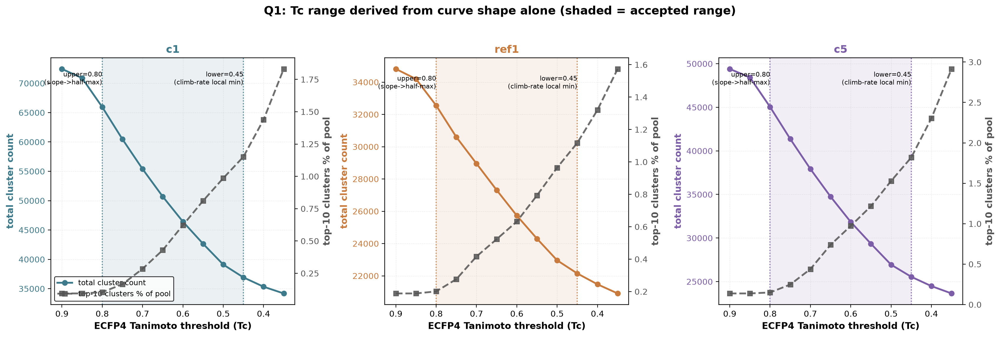
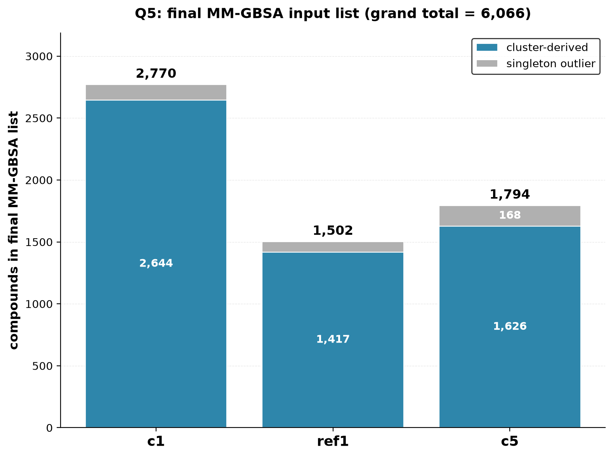

# post-docking-unidock-enamine

Post-docking analysis for the 5-HT1A ultra-large screen (Enamine REAL Space,
~192M compounds vs. conformations c1/ref1/c5, docked+AD4-redocked on CINECA
and MareNostrum). Runs on Barcelona (`shiva`) only, against results copied
over from both clusters.

## The filtering funnel, in order

Each step runs on the previous step's own output and never re-opens an
earlier step's decision (e.g. strain filtering never re-picks which pose
"won" -- that was already decided by the interaction filter).

Steps 0-2 run in a separate repo (library prep, before any docking).
Steps 3-8 are this repo.

| # | step | script | c1 | ref1 | c5 |
|---|------|--------|----|------|-----|
| 0 | Enamine REAL Space, full | (separate repo) | 69,000,000,000 total | | |
| 1 | + property/PAINS/similarity pre-screen | (separate repo) | **191,904,689** total | | |
| 2 | top 1% by vina score -> AD4 redock | (separate repo) | **1,919,047** each | | |
| 3 | + salt-bridge interaction filter (Asp116, 5.0A) | `interaction_filter_fast.py` | **1,780,753** | **1,042,591** | **1,539,369** |
| 4 | + strain filter (Total>=7.0 OR Single>=1.8 TEU) | `strain_filter.py` -> `collect_final_hits.py` | **117,404** | **56,904** | **96,478** |
| 5 | + AD4 score cutoff (<=-7.0) | `apply_score_cutoff.py` | **106,380** | **51,195** | **71,264** |
| 6 | + dedup stereoisomers/tautomers | `dedup_stereoisomers.py` | **95,468** | **47,790** | **65,364** |
| 7 | + BM+Tanimoto clustering, Q1-Q5 selection | `nested_bm_clustering/` | **2,770** | **1,502** | **1,794** |
| 8 | MM-GBSA rescoring (running now) | `mmgbsa_rescore/run_mmgbsa_q5.py` | - | - | - |

Totals in rows 0/1 are pool-wide, not per-conformation (the split into
c1/ref1/c5 happens at row 2's AD4 redock). Step 1's pre-screen (69B ->
191,904,689): MW 200-500 Da, LogP 0-5, 1-2 positive charge centers, 0
negative charge centers, <=2 chiral centers, <=10 rotatable bonds, TPSA
<=140, 20-40 heavy atoms, 2-6 rings, 2-12 heteroatoms, Enamine class S
only (M and U dropped), PAINS filtered out, Tanimoto <0.35 to all of
5,250 known GPCRdb actives.

Row 4 is the single biggest cut in this repo: strain filtering removes
~93-95% of what the salt-bridge filter alone passed (e.g. c1:
1,780,753 -> 117,404), consistent with the paper's own finding that a
high-scoring docked pose can get that score *by* adopting a strained
conformation.

## Where the data lives

Cloned inside `~/ultra-large/`, alongside the data it operates on (not
tracked in git -- too large):

```
~/ultra-large/
├── post-docking-unidock-enamine/   <- this repo (steps 7-8's output lives
│                                       inside it, gitignored -- see below)
├── envs/post-dock/                 <- conda env for every step (see below)
├── receptors/                      <- c1.pdb / c5.pdb / ref1.pdb + AD4 PDBQT builds
├── receptor_prep/                  <- gmx-ready receptors for mmgbsa_rescore/
└── vs_results/                     <- steps 3-6's real output, one dir per stage/conformation
```

Exact filenames at every step, plus how to drop MM-GBSA results made on
another machine into a fresh clone: **`DIRECTORY_STRUCTURE.md`**.

## Environment (all steps)

One env for the whole repo: steps 3-6 only need `rdkit`+`numpy`,
`nested_bm_clustering/` also needs `matplotlib`, `mmgbsa_rescore/` needs
the rest (gromacs, ambertools, gmx_mmpbsa, acpype, openbabel, mpi4py).

```
conda env create -f environment.yml -p ~/ultra-large/envs/post-dock
conda activate ~/ultra-large/envs/post-dock
bash install_pip.sh
```

## Step 3: `interaction_filter_fast.py`

Does a compound's docked pose put a charged nitrogen within 5.0A of Asp116's
CG carbon? Checks every pose in the SDF (unidock's real default is up to 9
poses/compound), picks the winner among salt-bridge-qualifying poses by best
AD4 score, reorders it to the front if it wasn't already there. Molecules
are never modified (`sanitize=False`, byte-identical pass-through). Full
methodology/validation notes are in the script's own docstring.

```
sbatch sbatch/interaction_filter_fast.sbatch <conformation> <receptor_pdb_path>
```

Output under `vs_results/interactions_passed_<conf>/`: the passing SDFs
(tar.gz), `interaction_filter_report_<conf>.csv` (every compound's
pass/fail/error), `reordered_compounds_<conf>.csv`, `ranked_hits_<conf>.csv`
(best-score-first), `run_summary_<conf>.txt`.

## Step 4: `strain_filter.py`

Filters the interaction filter's winning poses by conformational strain,
using Gu, Smith, Yang, Irwin, Shoichet, "Ligand Strain Energy in Large
Library Docking," JCIM 2021 (citation + DOI in
[interaction_filter_references.txt](interaction_filter_references.txt);
independently reimplemented in `torsion_lib.py`, verified against the
paper's own reference output before use). A pose is "strained" if
`total_TEU >= 7.0 OR single_TEU >= 1.8` (the paper's own DUD-E-general
default -- no 5-HT1A/aminergic-GPCR-specific calibration).

```
sbatch sbatch/strain_filter.sbatch <conformation> --dry_run   # counts only
sbatch sbatch/strain_filter.sbatch <conformation>              # writes survivors tar
```

Output under `vs_results/strain_filtered_<conf>/`:
`strain_filter_report_<conf>.csv`, `run_summary_<conf>.txt`,
`strain_filtered_<conf>.tar.gz`.

## `collect_final_hits.py`

Joins the interaction + strain filter reports, ranks by AD4 score, splits
into multi-SDF files (default 50,000/file, for loading in Maestro).

```
sbatch sbatch/collect_final_hits.sbatch <conformation> [chunk_size]
```

Output under `vs_results/final_hits_<conf>/`: `final_hits_<conf>.csv`
(rank, compound_id, ad4_score, total_TEU, single_TEU),
`score_range_report_<conf>.txt`, `final_hits_<conf>_partNN.sdf`.

## Step 5: `apply_score_cutoff.py`

Cuts `collect_final_hits.py`'s already-ranked output to `ad4_score <=
--cutoff` (default -6.0; -7.0 used for the real run above). Pure local
re-split of already-built files, no cluster job needed:

```
python apply_score_cutoff.py --conformation <conf> \
    --vs_results_dir ~/ultra-large/vs_results --cutoff -7.0
```

Output under `vs_results/final_hits_<conf>_cutoff<C>/`: same columns as
above, re-split into `_partNN.sdf` files.

## Step 6: `dedup_stereoisomers/`

Many rows in step 5's output are the same 2D compound, enumerated as
different stereoisomers/tautomers by the original library build. Keeps
only the best-AD4-scoring version of each.

```
python dedup_stereoisomers/dedup_stereoisomers.py --conformation <conf> \
    --vs_results_dir ~/ultra-large/vs_results --cutoff -7.0
```

Output under `<out_dir>/final_hits_<conf>_cutoff<C>_dedup/`.

## Step 7: `nested_bm_clustering/`

Two-pass clustering (Bemis-Murcko scaffold groups, then Tanimoto/Butina
within large groups) plus a 5-question pipeline (Q1-Q5, full reasoning in
`nested_bm_clustering/README.md`) that picks a validated, statistically
grounded set of compounds for MM-GBSA, not just "top N by AD4 score."




Row 7's counts (2,770 / 1,502 / 1,794) come from 1,735 / 959 / 1,053 kept
clusters (medoid + best scorer each) plus qualifying singletons.

Output: `q5/q5_mmgbsa_<conf>.sdf` + `q5/q5_mmgbsa_input_list.csv`.

## Step 8: `mmgbsa_rescore/`

MM-GBSA rescoring (Uni-GBSA, single-point energy-minimized pose + GB
solvation) of step 7's curated list. Needs `receptor_prep/`'s gmx-ready
receptors. Full usage, environment setup, and real benchmark numbers in
`mmgbsa_rescore/README.md`.

```
bash mmgbsa_rescore/run_all.sh <workers> <scratch_root>
```

Output under `mmgbsa_rescore/results/mmgbsa_<conf>/`:
`mmgbsa_results_<conf>.csv` (ranked by `mmgbsa_dg`, with `ad4_score`,
`cluster_id`, `role`, `source` carried through from step 7).
