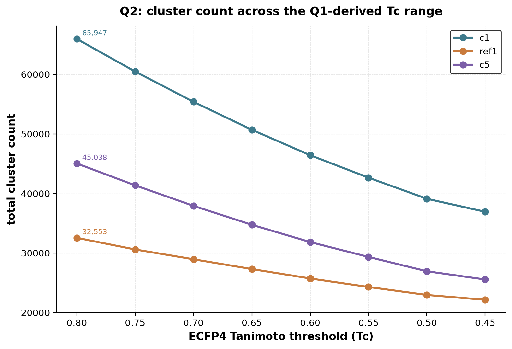
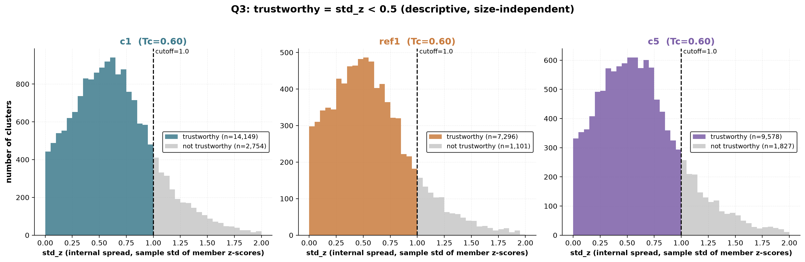
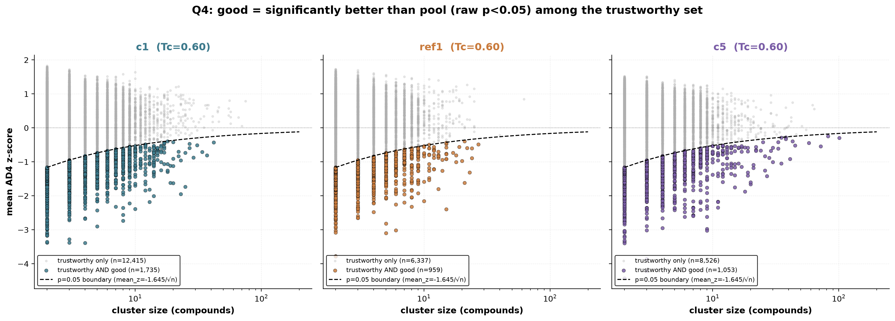

# nested_bm_clustering

Author: Anna Korda

Two-pass clustering: Bemis-Murcko scaffold groups first, then
Tanimoto/Butina only within large groups. Then a 5-question pipeline
(Q1-Q5) that turns `apply_score_cutoff.py`'s AD4 hit set into a validated
MM-GBSA input list. Runs on `dedup_stereoisomers/`'s output.

`nested_bm_clustering.py` runs the clustering itself (all 12 Tc thresholds,
0.90-0.35). Everything below (Q1-Q5) works from its output.

## Q1: which Tc range is informative?

Slope of the total-cluster-count curve (upper bound: where it falls to half
its peak) and the top-10%-of-pool curve's climb rate (lower bound: its
local minimum, before a chaining/step-event reacceleration). Identical for
all 3 conformations: **Tc in [0.45, 0.80]**, 8 grid points.


## Q2: cluster counts across that range

Total clusters per Tc, per conformation, over the Q1 range.



## Q3: trustworthy (internally consistent)

`std_z < 1.0` (sample std, ddof=1, of a cluster's own member z-scores;
~0.6-0.7 kcal/mol real AD4 spread). Descriptive cutoff, not a significance
test: trustworthiness measures disagreement between members, not
statistical confidence, so it shouldn't scale with cluster size.



## Q4: good (significantly better than pool)

Of Q3's trustworthy clusters: one-sided z-test, cluster `mean_z` vs. the
pool mean, raw p<0.05. Clearing both Q3 and Q4 independently is itself
protection against false positives.



## Q5: the MM-GBSA list

Per trustworthy+good cluster: fingerprint medoid (ECFP4 recompute, highest
mean intra-cluster Tanimoto) plus best AD4 scorer. Singletons (no cluster,
so no internal-consistency check applies) get their own rule: z<=-3.0
(standard outlier convention).


**Final, Tc=0.60:**

| | clusters kept | total compounds |
|---|---|---|
| c1 | 1,735 | 2,770 |
| ref1 | 959 | 1,502 |
| c5 | 1,053 | 1,794 |
| **all** | **3,747** | **6,066** |

Output: `q5/q5_mmgbsa_<conf>.sdf` (structures tagged with
CLUSTER_ID/ROLE/AD4_SCORE/SOURCE) and `q5/q5_mmgbsa_input_list.csv`. Feeds
directly into `mmgbsa_rescore/run_mmgbsa_q5.py`.

## Running it end to end

Run from inside `nested_bm_clustering/` (paths below are relative to that):

```
python nested_bm_clustering.py --conformation c1 --vs_results_dir ../vs_results/dedup --out_dir . --thresholds 0.90,...,0.35
python q1/q1_derive_tc_range.py
python q2/q2_cluster_counts.py
python q3/q3_trustworthy_std.py
python q4/q4_good_among_trustworthy.py
python q_singletons/q_singletons.py
python q5/q5_mmgbsa_input_list.py
```

Each step reads the previous step's output directly, no re-derivation.
`*_visualize.py` scripts alongside each Q regenerate that Q's plot from its
own already-written CSV.
